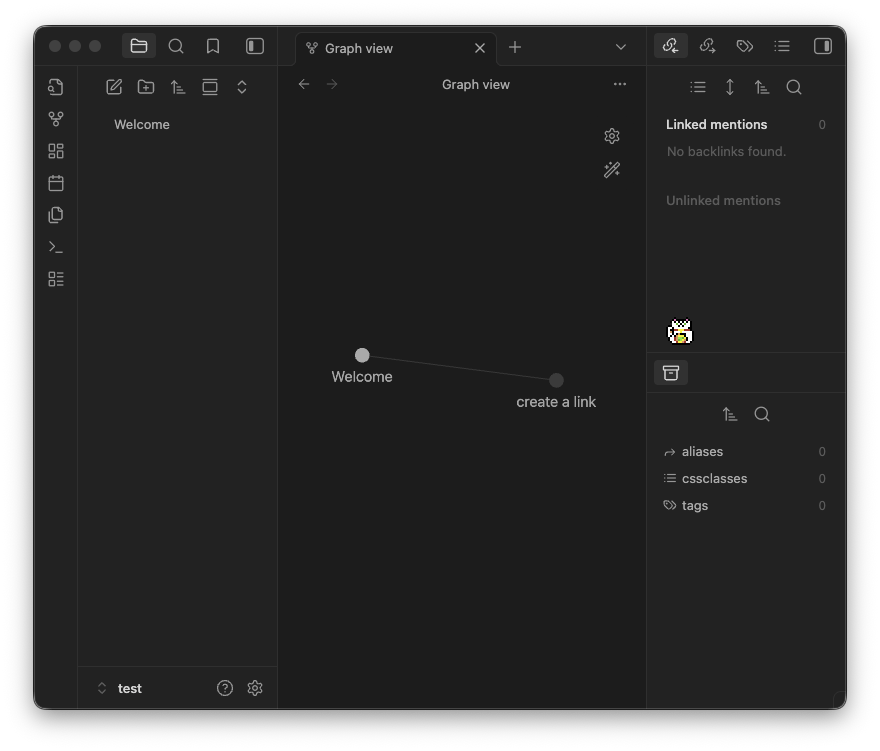

# Kitty Plugin

A lightweight desktop pet for Obsidian. Kitty brings a small, animated friend to your workspace that roams around your notes.

### What can Kitty do?
- Drag your pet anywhere in your workspace. They settle at the bottom of whatever you're working on.
- Includes **Kitty** (artwork by [Elthen](https://elthen.itch.io/2d-pixel-art-cat-sprites)) and a lucky **Maneki Neko** (artwork by me!).
- Your pet will explore, sit, or nap inside your notes.
- If you restart Obsidian, they can wait for you exactly where you left them.
- Upload your own pixel art to grow your library of custom desktop companions.

## Settings
- **Persist on relaunch**: Keeps the pet active and on the same leaf across Obsidian sessions.
- **Allow movement**: Enable or disable horizontal roaming.
- **Sprite selection**: Choose between different pets saved in your library.

### Sprite editor
- **Frame dimensions**: Configure a spritesheet by frame slice (e.g., `32, 32`).
- **Frame scale**: Pixel-perfect scaling for crisp pixel art.
- **Frames per second**: Control the speed of the animation cycle.

## Installation

### Community Plugins (Pending)
1. Open **Settings** > **Community Plugins**.
2. Select **Browse** and search for "Kitty".
3. Click **Install**, then **Enable**.

### Manual Installation
1. Download the latest release (`main.js`, `manifest.json`, `styles.css`).
2. Create a folder named `kitty` in your vault's `.obsidian/plugins/` directory.
3. Move the downloaded files into that folder and enable the plugin.

> **To start:** Open the Command Palette (`Cmd/Ctrl + P`) and run `Kitty: Toggle sprite`.

---

## Custom Sprites

You can find many free spritesheets online. I recommend [Aseprite](https://github.com/aseprite/aseprite) for creating your own.

1. **Prepare your image**: Use a transparent `.png` where the animations are laid out in a grid.
2. **Import**: Use the **Choose file** button in the settings to copy it to your library.
3. **Save**: Give it a name and hit **Save to library**.

> **NOTE:** If your sprite is facing the wrong way, you'll need to horizontally reflect the image file! The plugin handles horizontal flipping based on movement direction!
